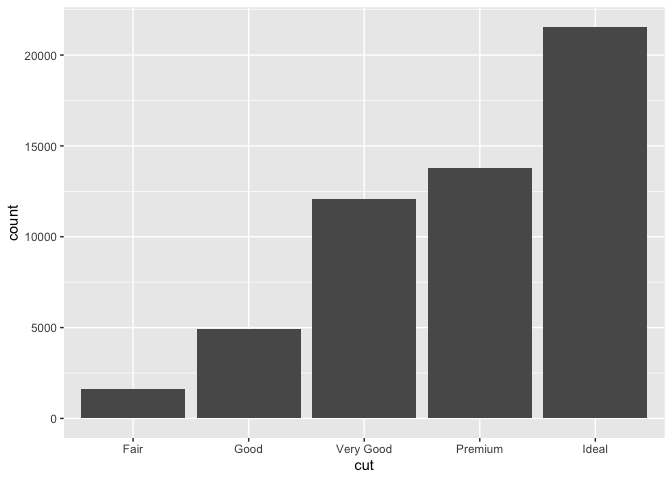

Getting started with R
================
Agoston Reguly

## Download and install R and RStudio

R and RStudio are two distinct software. R is the core that enables us
to run different commands, scripts, etc., while RStudio ensures a
convenient IDE (integrated development environment), that helps us to
use and develop codes in R.

First, you have to download both - free - software, then install them:

1.  `R` from <https://cran.r-project.org>
2.  `RStudio Desktop` (Open Source License) from
    <https://www.rstudio.com/products/rstudio/download>

## Getting familiar with the interface

Open and then show the following features of RStudio:

Different windows:

-   The Console/Terminal/Jobs window: what are they and how to use them
-   Scripts and Files window: the main programming will happen here
-   Environment/History/Connection/Tutorial window
-   Files/Plots/Packages/Help/Viewer window

## Using the console

R can be used as a calculator through the console! E.g. you can type in:

``` r
2+2
```

    ## [1] 4

and R will calculate and show the result in the console window. Note
that every command that you do will show in the console window. It can
be useful if you are getting familiar with and using some of the
‘clicking’ options in R as we will see with data import.

## Opening a script

Codes that we are going to use in this course are stored in scripts.

At this point, the lecturer should decide if she/he will run
`intro_to_R.R` as a demonstration and ask students to pay attention or
can do the running together. There is no perfect choice, both have some
pros and cons.

Doing it alone and only showing:

-   Pro:

    -   can show it quickly approx 5-10 min
    -   R will look easy and cool
    -   can fix problems one-by-one after classes. (Usually, it is
        really time-consuming to fix all the possible issues for each
        student. If it is done in class students will start doing other
        stuff.)

-   Con:

    -   can not avoid teaching some basics to run the piece, thus this
        part will be taught in the next class.
    -   not engaging the students
    -   students can be frustrated if it is homework to run these codes
        and end up with errors.

If teacher decides to do it together, then consider
`lecture01-coding-basics/coding_basics.md` first part: *Creating the
first script*.

-   Pro:

    -   students are engaged
    -   after a successful session teacher can be sure that all students
        are on the same page and everything runs nicely

-   Con:

    -   usually takes a lot of time (20-40 min for 30 students)
    -   while the teacher fixes one student’s problem, others are bored
    -   not the most efficient use of the time

### Alternative: use console only

If decided not to start with a script, it is advised to install the most
used package `tidyverse` as a) it takes some time b) it will show you if
there is a problem with any student. In this case, just ask students to
write the following piece of code into the console:

``` r
install.packages('tidyverse')
```

``` r
library(ggplot2)
ggplot(diamonds, aes(cut)) + geom_bar()
```

<!-- -->

However, in this case, do not forget to tell them:

-   In R there are packages, which are called via
    `install.packages("*name*")`
-   After you installed a package, you can load the package via
    `library(*name*)`
-   Packages are great as they include many different functions, which
    will do several things we need.

## Opening a Rmarkdown file

RMarkdown is a powerful tool, provided in RStudio, which helps to create
reports rigorously, automatize reports, create an html, etc.

It is always a good practice to try to knit at the first class an
Rmarkdown file. This is the most painful process of the course, to make
sure that everybody can knit an Rmarkdown file into a pdf or a html
file. Usually, the problem is with pdf. Therefore it is good to start in
the first class to identify the problem and then the teacher needs to
pay individual attention to each case. Of course, there are several
common mistakes/problems (see more in: [*Help to knit my document in
RMarkdown*](https://github.com/gabors-data-analysis/da-coding-rstats/common_issues/help_rmarkdown.md)),
but in each year there are something new, that needs individual fixes…
(alternatively can use RStudio via a cloud, which has other pros and
cons.)

Open `test_Rmarkdown.Rmd` and knit with **both** output options:

-   output: pdf_document
-   output: html_document

## Git and GitHub

WIP
