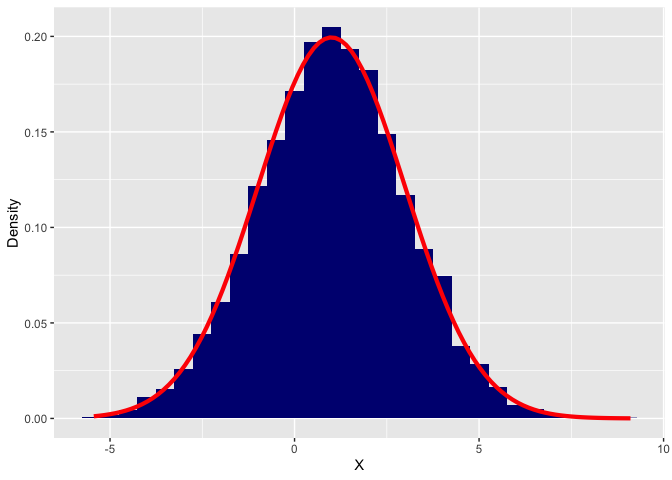
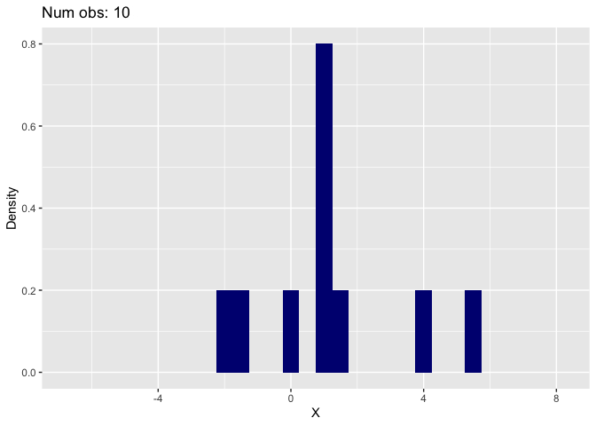
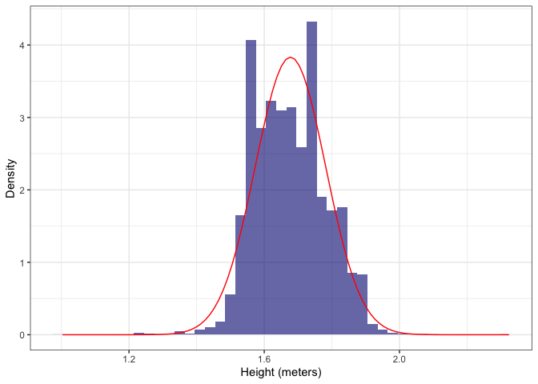
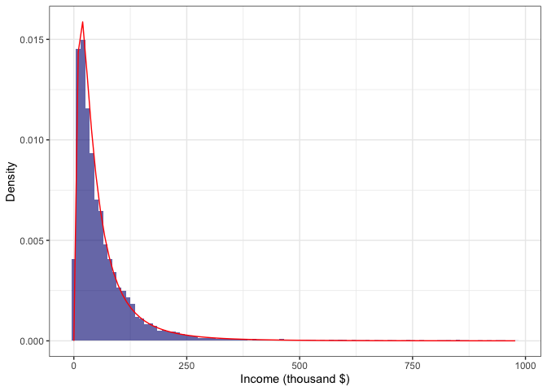
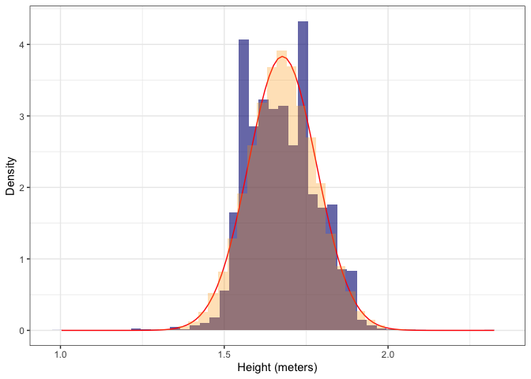
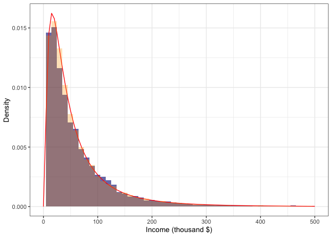

Random Numbers and Random Sampling in R
================
Agoston Reguly

Datasets:

-   [height-income-distributions](https://gabors-data-analysis.com/datasets/#height-income-distributions)
-   [sp500](https://gabors-data-analysis.com/datasets/#sp500)

## Random Numbers

In dealing with data, the use of random numbers is essential. In any
case, you will not use them directly (unless you are carrying out a
Monte-Carlo simulation), but many advanced models use them indeed
directly or as random sampling. Some examples:

-   get a random (sub)-sample (e.g. cross-validation techniques)
-   bootstrapping (to calculate standard errors)
-   estimating models (e.g. machine learning methods or (quasi)
    maximum-likelihood methods)
-   ‘stochastic’ optimization methods (e.g. genetic algorithms)

Here we cover only the main properties and how to use them if we would
like to have reproducible results.

### Different distributions

Data that we observe have an empirical distribution. In theory, we use
some theoretical distributions, which can be characterized as a function
and they are useful as many real-life variables tend to be similar (or
at the limit the same) as the theoretical distribution. In base-R, there
are many pre-programmed distributions, which can be checked by
`?distribution`. Let us first discuss the *uniform* distribution, which
has a lower and upper bound and all values within have the same
probability. It can be called via `*unif`, where `*` stands for one of
the followings:

-   r: random number generation
-   d: density or probability mass function
-   p: cumulative distribution
-   q: quantiles

Here we will focus on `runif` to generate random numbers, but it is good
to know that they exist and you can compute specific values of the
chosen distribution.

If we would like to have 5 randomly drawn numbers from a uniform
distribution between 0 and 1, we can run the following code:

``` r
runif( 5, min = 0, max = 1)
```

    ## [1] 0.26070668 0.27004785 0.17635193 0.02415626 0.27703152

Note that if you re-run this piece of code it will result in different
values. Naturally, the question emerges, how to write a code, which will
produce the same random numbers and thus the same results? It turns out
you can *set the seed* for the random number generation:

``` r
set.seed(1234)
runif( 5, min = 0, max = 1)
```

    ## [1] 0.1137034 0.6222994 0.6092747 0.6233794 0.8609154

which will ensure that you will get the same random numbers. Note that
they are only the same if you run both lines of commands together, after
each other.

*Good-to-know:* Generating truly random numbers is not an easy task in
computer science and it has its own jargon. At our level, it works
completely fine, but if you are interested, you can check a short
overview on this topic
e.g. [here](https://thecodeboss.dev/2017/05/why-random-numbers-are-impossible-in-software/).

### Normal distribution

A commonly used distribution due to its mathematical properties and its
occurrence in the real data is the normal distribution. You can generate
a normally distributed random variable with `rnorm` function where you
can set the mean and the standard deviation.

``` r
n <- 10000
y <- rnorm( n, mean = 1, sd = 2 )
df <- tibble( rnd_norm = y )
ggplot( df, aes( x = rnd_norm ) ) +
  geom_histogram( aes( y = ..density.. ), fill = 'navyblue', bins = 30 ) +
  stat_function( fun = dnorm, args = list( mean = 1, sd = 2 ),
                 color = 'red', size = 1.5 )+
  labs(x='X',y='Density')
```

<!-- -->

You may play around with the number of observations generated and check
how the generated variable converges to the true (theoretical)
distribution! You should have something similar!

<!-- -->

There are other useful distributions that you can check out. E.g.:

-   `rbinom` (binomial distribution)
-   `rexp` (exponential distribution)
-   `rlnorm` (log-normal distribution)

## Exercise: `height-income-distributions`

Next, let us check the difference between the artificially generated
theoretical and the empirically observed variables’ distributions.

``` r
# Get data from OSF
df <- read_csv('https://osf.io/rnuh2/download')
# set height as numeric
df <- df %>% mutate( height = as.numeric( height ) )
```

First, let us start with the height of people which is close to the
normal distribution.

``` r
# Create a empirical histogram of height with theoretical normal
emp_height <- ggplot( df, aes( x = height ) ) +
  geom_histogram( aes( y = ..density.. ), binwidth = 0.03, 
                 fill = 'navyblue', alpha = 0.6 ) +
  stat_function( fun = dnorm, color = 'red',  
                 args = with( df, c( mean = mean( height, na.rm = T ), sd = sd( height, na.rm = T ) ) ) ) + 
  labs(x='Height (meters)', y='Density' ) +
    theme_bw()

emp_height
```

<!-- -->

As you may see the theoretical normal distribution is close but far from
a perfect fit.

Next, let us check the distribution of income, which is close to the
log-normal distribution. For better visualization, we restrict our
attention to incomes less than 1000 thousand $.

``` r
# Calculate the empirical mean and standard deviation 
#   (see eg.: https://en.wikipedia.org/wiki/Log-normal_distribution)
mu <- with( filter( df, hhincome < 1000 ), 
            log( mean( hhincome )^2 / sqrt( var( hhincome ) + mean( hhincome )^2 ) ) )
sigma <- with( filter( df, hhincome < 1000 ),
               sqrt( log( var( hhincome ) / mean( hhincome )^2 + 1 ) ) )

emp_inc <- ggplot( filter( df, hhincome < 1000 ), aes( x = hhincome ) ) +
  geom_histogram( aes( y = ..density.. ), binwidth = 10,
                 fill = 'navyblue', alpha = 0.6 ) +
  stat_function( fun = dlnorm, colour= 'red',  
                 args = c( mean = mu, sd =  sigma ) ) + 
  labs(x='Income (thousand $)', y='Density' ) +
    theme_bw()

emp_inc
```

<!-- -->

Here, the theoretical and empirical distributions are much closer.

As a next step let us generate two artificial variables, one with normal
and the second with log-normal distributions, where the moments are the
same as for the empirical distributions.

``` r
set.seed(123)
artif <- tibble( height_art = rnorm( nrow( df ), mean( df$height, na.rm = T ), 
                                                 sd = sd( df$height, na.rm = T ) ),
                inc_art = rlnorm( nrow( df ), meanlog = mu, sdlog = sigma ) )
```

We can compare these artificial random variables with the truly observed
variables. Let us start with height.

``` r
emp_height + geom_histogram( data = artif, aes( x = height_art, y = ..density.. ), 
                             binwidth = 0.03, boundary = 1.3, 
                 fill = 'orange', alpha = 0.3 )
```

<!-- -->

The artificial variable is much closer to the theoretical distribution.

The income can be checked similarly.

``` r
emp_inc + geom_histogram( data = artif, aes( x = inc_art, y = ..density.. ), binwidth = 10,
                          fill = 'orange', alpha = 0.3 ) +
        xlim(0,500)
```

<!-- -->

It would be difficult to tell if there is a difference between the two
variables.

**Task:** Transform the income variable to log income and check with a
normal distribution along with an artificially generated normal
distribution with the same mean and sd. Hint: use `ifelse()` when
creating log-income to avoid log(0).

## Random sampling

Random sampling is one of the most powerful tools used nowadays in
statistics. It selects a random part of your original data and you will
do the manipulations with only those parts. Later we will use this
extensively in many cases hidden in our models, therefore it is useful
to have an idea of how to get a random sample.

The function offered by the tidyverse (or dplyr) package is
`slice_sample( df, n = size, raplece = F )`, where `df` is the original
tibble and `size` is a non-negative integer giving the number of
observations (rows) to choose and `replace` decides if one observation
(or row) can be used multiple times or not. Usually, this last input is
neglected as we want to get a random sample **without** replacement. A
good exception is *bootstrapping*, where we resample with replacement
wich allows to have the same number of observations as the original
data.

To show how this method works, let us use the **`sp500`** data and get a
randomly selected sub-sample with 100 observations, without replacement.

``` r
sp500 <- read_csv('https://osf.io/h64z2/download')
head(sp500)
```

    ## # A tibble: 6 × 2
    ##   DATE       VALUE  
    ##   <date>     <chr>  
    ## 1 2006-08-25 1295.09
    ## 2 2006-08-28 1301.78
    ## 3 2006-08-29 1304.28
    ## 4 2006-08-30 1304.27
    ## 5 2006-08-31 1303.82
    ## 6 2006-09-01 1311.01

``` r
set.seed(123)
sp500_ss <- slice_sample( sp500, n = 100 )
head(sp500_ss)
```

    ## # A tibble: 6 × 2
    ##   DATE       VALUE  
    ##   <date>     <chr>  
    ## 1 2016-02-02 1903.03
    ## 2 2016-04-08 2047.60
    ## 3 2015-03-09 2079.43
    ## 4 2008-08-29 1282.83
    ## 5 2007-05-24 1507.51
    ## 6 2013-09-16 1697.60

Note that we have used here `set.seed` purposefully, to be able to
replicate the results.

**Good-to-know:** As usual with R there are many other options to get a
random sample. In our experience, `sample_n( df, size )` is the most
commonly used, however it is now getting depreciated in `tidyverse`.
Also in many cases people use the base-R function, which is called
`sample( x, size, replace = F )`, but here you can not support tibbles
in `x`, but vectors. Also good to know about
`sample.int( n, size = n, replace = F )`, which is similarly a base-R
function and it provides you random *index values*, therefore if you
want to select observations through indexing (e.g. use the same indexes
for multiple vectors/tibbles), then you may want to use that.
